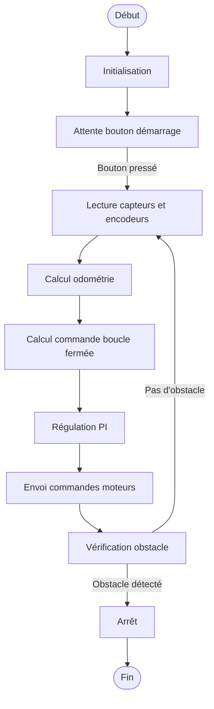

# Robot Suiveur de Ligne - Projet M1 Robotique Mobile

Projet de prototypage réalisé dans le cadre du Master 1 de Robotique Mobile à Junia. Ce dépôt contient le code et la documentation d'un robot suiveur de ligne basé sur une architecture Arduino Mega.

## 📌 Contexte du Projet

Ce projet a été développé par un groupe d'étudiants en M1 Robotique Mobile. L'objectif est de concevoir et implémenter un robot capable de suivre une ligne au sol tout en évitant les obstacles, en utilisant des capteurs, des moteurs et une commande en boucle fermée.

## 📁 Structure du Projet

```
robot-suiveur-ligne/
├── algo.md                  # Algorithme initial (version simplifiée)
├── algo2.md                 # Algorithme actuel (version implémentée)
├── robot_suiveur_ligne.ino  # Code principal Arduino
├── Nomenclature composants.pdf  # Liste des composants utilisés
└── README.md                # Ce fichier
```

## 🔧 Matériel Utilisé

- **Contrôleur** : Arduino Mega
- **Moteurs** : 2 moteurs CC avec encodeurs
- **Capteurs** :
  - 2 capteurs de ligne (gauche et droit)
  - 1 capteur d'obstacle (IR)
- **Bouton de démarrage** : Pour lancer le suivi de ligne
- **Drivers moteurs** : PmodHB5 pour la commande PWM

## 📖 Algorithmes

### Version Initiale (`algo.md`)
Un algorithme simple basé sur la détection de ligne avec deux capteurs. Le robot ajuste sa direction en fonction de l'état des capteurs (gauche, droit, ou les deux).

### Version Actuelle (`algo2.md`)
Une implémentation plus avancée avec :
- **Odométrie** : Calcul de la position (x, y, θ) à partir des encodeurs.
- **Commande en boucle fermée** : Navigation vers une cible (xp, yp, thetap).
- **Correcteur PI** : Régulation des moteurs pour un suivi précis.
- **Cinématique inverse** : Conversion des vitesses (V, Ω) en consignes moteur.
- **Gestion des obstacles** : Arrêt en cas de détection d'obstacle.

## 🛠️ Fonctionnalités Clés

1. **Initialisation** : Configuration des broches, moteurs, encodeurs et capteurs.
2. **Suivi de Ligne** : Utilisation des capteurs pour ajuster la trajectoire.
3. **Odométrie** : Estimation de la position en temps réel.
4. **Commande PI** : Contrôle précis des moteurs.
5. **Évitement d'obstacles** : Arrêt automatique en cas de détection.

## 📊 Diagrammes

### Algorithme Actuel



## 🚀 Comment Utiliser

1. **Branchement** : Connecter les capteurs, moteurs et encodeurs selon la nomenclature.
2. **Téléversement** : Upload du code `robot_suiveur_ligne.ino` sur l'Arduino Mega.
3. **Lancement** : Appuyer sur le bouton de démarrage pour activer le suivi de ligne.

## 📝 Notes

- Ce projet est un prototype académique et peut nécessiter des ajustements pour une utilisation en conditions réelles.
- Les paramètres du correcteur PI (`Kp`, `Ki`) sont optimisés pour une réponse rapide avec un dépassement ≤ 10%.
- La cible (xp, yp, thetap) est définie dans le code et peut être modifiée selon les besoins.

## 👥 Équipe du Projet

Projet réalisé dans le cadre du Master 1 Robotique Mobile à [Junia](https://www.junia.com/).

## 📄 Licence

Ce projet est sous licence MIT. Voir le fichier [LICENSE](LICENSE) pour plus de détails.
