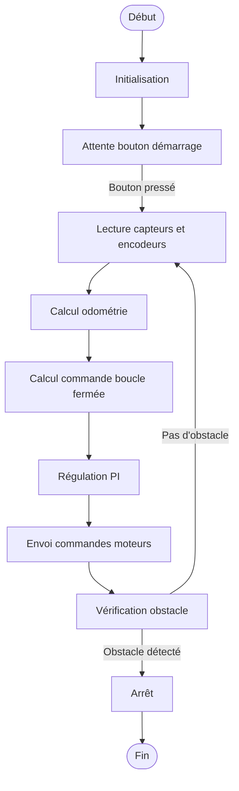

# Algorithme Actuel du Robot Suiveur de Ligne

## Initialisation

1. **Configuration des broches** : Initialisation des broches pour les capteurs, moteurs, encodeurs, bouton de démarrage et capteur d'obstacle.
2. **Arrêt initial des moteurs** : Les moteurs sont arrêtés au démarrage.
3. **Configuration des interruptions** : Les interruptions sont configurées pour les encodeurs afin de compter les ticks.
4. **Attente du bouton de démarrage** : Le robot attend que le bouton de démarrage soit pressé pour commencer.

## Boucle Principale

### Lecture des Capteurs

1. **Capteurs de ligne** : Lecture des capteurs gauche et droit pour détecter la présence de la ligne.
2. **Encodeurs** : Lecture des ticks des encodeurs pour calculer les distances parcourues par chaque roue.

### Odométrie

1. **Calcul des distances** : Conversion des ticks en distances parcourues par les roues droite et gauche.
2. **Mise à jour de la position** : Calcul de la nouvelle position (x, y) et de l'orientation (θ) du robot.

### Commande en Boucle Fermée

1. **Calcul de l'erreur** : Calcul de la distance (ρ) et des angles (α, β) entre la position actuelle et la cible.
2. **Vitesse de consigne** : Calcul des vitesses linéaire (V) et angulaire (Ω) souhaitées en fonction de l'erreur.
3. **Cinématique inverse** : Conversion des vitesses (V, Ω) en consignes de vitesse pour chaque moteur.

### Régulation PI

1. **Correcteur PI** : Calcul de la commande PWM pour chaque moteur en utilisant un correcteur PI avec anti-windup.
2. **Envoi des commandes** : Envoi des commandes PWM aux moteurs pour ajuster leur vitesse.

### Gestion des Obstacles

1. **Détection d'obstacle** : Vérification de la présence d'un obstacle à l'aide du capteur d'obstacle.
2. **Arrêt en cas d'obstacle** : Si un obstacle est détecté, le robot s'arrête.

## Fonctions Auxiliaires

### Correcteur PI

- **computePID** : Calcule la commande PWM en fonction de la consigne et de la vitesse mesurée, avec saturation et anti-windup.

### Gestion des Moteurs

- **setMotorPower** : Envoie la commande PWM et la direction au moteur.

### Odométrie

- **wrap_to_pi** : Normalise un angle dans l'intervalle [-π, π].

## Flux de Contrôle

## Notes

- Le robot utilise une commande en boucle fermée pour naviguer vers une cible définie (xp, yp, thetap).
- Les capteurs de ligne sont lus mais ne sont pas directement utilisés dans la logique de commande actuelle.
- La régulation PI permet un contrôle précis des moteurs pour atteindre la cible.
